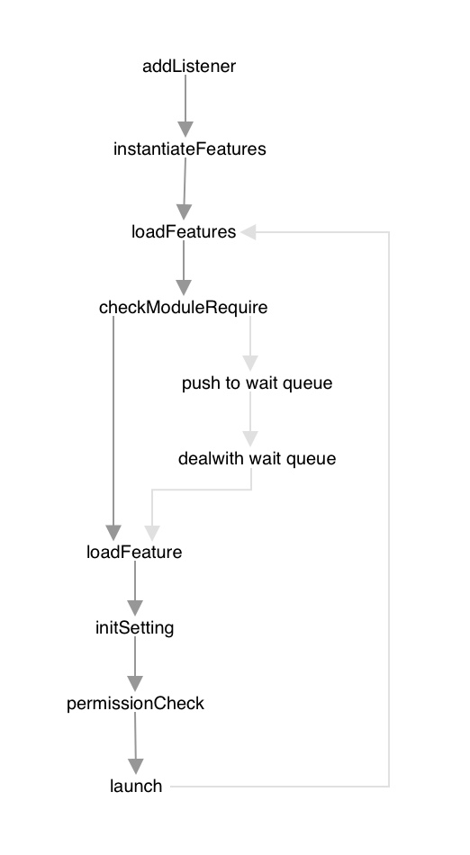

# FeatureManager

FeatureManager在background.js中被加载并实例化。它以依赖加载的方式完成扩展功能的载入。

### addListener

该方法监听了一些实用的事件，分别如下：

getSettings {FeatureName: FeatureSettingObject} 该事件根据如下参数返回相应feature的配置

| Name      | Description                                                 |
| --------- | ----------------------------------------------------------- |
| feature   | 如果指定feature则优先返回指定名称的Feature的配置            |
| kind      | 如果指定kind则返回指定kind那一类Feature的配置               |
| checkHide | 如果设置checkHide为true，则忽略那些配置有checkHide的Feature |
| hasUI     | 只获取有该setting配置的Feature                              |

inIncognitoContext {boolean} 返回浏览器当前是否处于隐私模式的状态

setSetting 设置指定参数（feature）的配置

getSetting 获取指定参数（feature）的配置

### instantiateFeatures

### loadFeatures

### checkModuleRequire

### loadFeautre

### initSetting

### permissionCheck

### launch

### dealwith wait queue

## Listener

| commend            | other properties                                             | Description                  | Return                                                       |
| ------------------ | ------------------------------------------------------------ | ---------------------------- | ------------------------------------------------------------ |
| getSettings        | feature：指定返回某一个功能的配置 kind：指定返回某一类功能的配置 checkHide：过滤掉不需要显示配置的功能 hasUI：过滤出拥有UI的配置 | 返回功能的配置               | {FeatureName: [SettingObject](./Feature.md/#SettingObject), ...} |
| inIncognitoContext |                                                              | 返回用户所处的隐私模式的状态 | Bool                                                         |
| setSetting         | feature：指定设置某一个功能的配置 settings              | 设置某个功能的配置           | true                                                         |
| getSetting         | feature：指定获取某一个功能的配置                            | 获取某个功能的配置           | settings                                                     |

