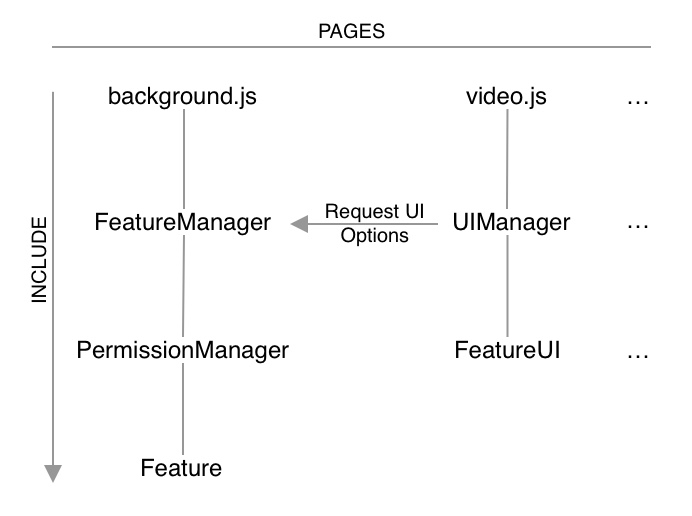

# 概要

助手是一款集合多个功能点为一体的chrome扩展应用，用于提升B站用户的用户体验。

重构的主要目标是使得各个功能点的作用和界限尽可能的泾渭分明相互协调，而非混乱的相互牵扯难以管理的。

该目标同时也能够让用户在使用本扩展时更好的通过设置页面进行个性化定制。

简言之，即“可扩展优先”。基于扩展的主要目标，将思路主要集中在功能点构建的约定上，约定尽可能保持目录结构统一，约定逻辑合理且明确。最终确保充分的可扩展性由能够统一而不混乱。

------



上图为整体概览，有如下描述：

1. 扩展是在background.js中依赖功能管理器（FeatureManager）加载功能的
2. 加载功能时经过权限管理器（PermissionManager）处理，根据鉴权结果调整扩展状态
3. 扩展在相关页面（如视频播放页面）被打开时，通过相关页面的入口文件（如video.js）请求相关功能的配置进行动态的UI加载

### 您可能会有如下需求：

1. 创建一个拥有定时器的功能，参见 [dynamicCheck](../src/js/modules/dynamicCheck/index.js)
2. 创建一个拥有UI的功能，参见 [menu](../src/js/modules/menu)
3. 创建一个后端发送消息来更新UI的功能，参见 [videoDownload](../src/js/modules/videoDownload)

### 模块介绍

videoDownload - 视频下载: [Link](./modules/videoDownload.md)

### 注意：

1. 如果您需要为新页面添加功能并且需要集成到同一个UI下，需要先创建类似 [VideoAnchor](../src/js/modules/videoAnchor) 这样的锚模块（容器），并参见 [danmu](../src/js/modules/danmu) 功能进行定向UI注入
2. 如果您需要为功能添加权限校验，需要添加permissions属性。如`login`对用户登录状态进行校验，并约定在状态改变时，会触发Feature类的`permissionHandle${PermissionName}`方法，具体参见Feature类[Link](../src/js/libs/feature.js)。
3. 如果您需要为功能添加i18n支持，参见 [Menu](../src/js/modules/menu) 功能

### 其他：

FeatureManager：[link](./FeatureManager.md)

Feature：[link](./Feature.md)

UIManager: [link](./UIManager.md)

MessageStore: [link](./MessageStore.md)


### 如何开始？

```bash
# dev + watch + bundle analytics
$ npm run watch

# 编译正式版
$ npm run build

# 编译测试版
$ npm run build:test

# 其他参数
--setversion versionString # 设置版本号
# npm run watch --setversion=1.2.2
# npm run build:test --setversion=1.2.2-beta.1
```

### 项目的约定简述

1. 约定使用FeatureManager加载功能点；
2. 约定使用基于Feature类与UI类进行功能点和UI的二次开发，必要时可以对Feature类进行扩充；
3. 约定使用统一的目录结构，具体可参见[Feature](./Feature.md)类中Directory部分；
4. 约定统一使用PermissionManager进行权限管理；
5. 约定为每个模块单独创建`_locales`目录，只有整个功能中通用或与单独功能无关的可写在外部`_locales`中；
6. 约定使用Styled-component进行样式注入；
7. 约定使用theme.color调用样式库的颜色，尤其`bilibili-blue`和`bilibili-pink`；
8. 待补充……

### 测试概要 - 尚未实现

单元测试-针对单个功能点（module）

1. 目录结构测试
2. 命名规范测试
3. 功能的配置测试

单元测试中的继承测试：

1. api测试，为相关功能单独写单元测试

生产环境测试：

主要测FeatureManager，Feature和UI等基础类的行为，通过输出有效的调试信息来人为的确认运行结果。